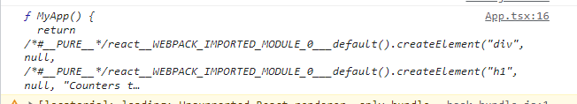

# 远程组件预研

## 1. 远程组件定义

远程组件，是指从服务端加载js代码并渲染成组件

流程：

1. 将组件打包
2. 将打包后的js上传到服务器
3. 使用远程组件时，通过接口获取js代码
4. 将组件利用 `Vue` 中的动态组件或者 `React` 中 `React.createElement` 进行渲染。

## 2. 远程组件应用场景

在一个低代码系统中，如我们的自定义对象，有一些常用的固化组件。但固化组件不能完全满足业务方和用户的需求，需要能够提供一个入口，自己上传自定义组件。

* **业务方使用**
  1. 需要频繁更改的非固化组件，使用现有方案每次都需要走一个完整的开发周期（建需求->拉分支->改代码->打包->发布->测试），使用远程组件以后，周期缩短为（建需求->改代码->保存->测试），及时看效果，提高效率
  2. 未来新增非固化组件，可以直接以远程组件的形式上传远端，减少了代码的耦合（相当于我们只提供一个低代码基座，用户可以像使用游戏mod一样热插拔使用）
* **用户使用**
用户是无法在我们的qince-web里面写非固化组件的，而远程组件为他们提供了扩展能力

## 3. 远程组件加载方案

在刀耕火种的原生js时代，可以随意通过 `script` 标签加载js代码。在今天当然也可以，但写原生js的效率太低辣，而且也无法用antd等组件库，所以这种方案可以扔掉了。

想要在现代前端框架内加载远程组件，首先我们要知道组件是什么，以React为例，我们在React中加载一个组件，然后打印结果

```javascript
import MyApp from './MyApp';
console.log(MyApp)
```



可以看到打印出来的是编译后的函数组件，然后我们再去看打包产物


这是用babel用commonjs规范转的，也就是说我们只要从打包上传的代码里拿到函数组件就行了，但是从后端获取到的js文件是文本格式，那么我们首当其冲就想到了eval

### eval方案

但是eval的缺点太多了，不安全，严格模式下不能用，而且无法解决全局变量污染的问题，也就是做不了沙箱，就不展开说了

### 使用 `New Function` 的形式

```typescript
/**
 * @param {string} arg  入参
 * @param {string} code  函数体
 * @return {Function}
 */
Function(arg: string, code: string)
```

```tsx
const getParsedModule = (code: string) => {
  const _exports = { default: undefined as any };
  const _require = (name: keyof typeof packages) => packages[name];
  // 由于远程组件不在模块内
  // 所以需要模拟组件内的require和exports
  Function('require, exports', code)(_require, _exports);
  return _exports;
};

//...

const CompExport = getParsedModule(res.js!);
if (!CompExport.default) {
    throw new Error('远程组件没有export default');
}
setComponent(() => CompExport.default);

//...

return <Component {...props}>{children}</Component>
```

## 远程组件上传方案

在网络上所有文章的上传方案都是rollup打包并上传，但是问题来了，还要用rollup打包？业务方还算能接受，用户怕是难以接受。而且打包后再上传，无法保存原有的React代码信息，可读性很差。有没有一种更简便，更优雅的方式

### Babel的函数式使用

不论项目是用webpack打包还是rollup打包，都是用loader编译代码的，比如我们项目就是用babel-loader编译的，而babel是能以函数形式使用的

```javascript
  let compiled, errorMsg;
  // 定义babelConfig
  const isTs = lang === 'typescript';
  const presets = [
    [
      'env',
      {
        targets: {
          browsers: ['defaults', 'not ie 11', 'not ie_mob 11'],
        },
        modules: 'commonjs',
      },
    ],
    'react',
  ];
  isTs && presets.push('typescript');
  const babelConfig = {
    babelrc: false,
    filename: `index.${isTs ? 'tsx' : 'jsx'}`,
    sourceMap: false,
    presets,
    sourceType: 'module',
  };
  try {
    // 编译代码
    const transformed = Babel.transform(code, babelConfig);
    compiled = transformed.code;
  } catch (err: any) {
    console.error(err);
    errorMsg = err?.message;
  }
  return { compiled, errorMsg };
```

这样用户就可以只上传React代码，省去了打包，方便了许多，而我们可以同时保存React代码和编译后的代码，React代码可以用于查看代码，而编译后的代码用于渲染组件。

再更进一步，结合前端代码编辑器codemirror，让用户可以在网页上编写代码并保存，进一步为用户提供了便利

### Babel遇到的问题

想法是好的，但用起来没有那么简单，Babel是用于node环境而不是浏览器环境的，而一些node api在浏览器中使用就直接报错，比如 `import path from 'path'` 。如何解决这个问题呢，神奇的worker-loader在inline模式下会将将worker作为blob内联，而blob中是有文件系统的，`import path from 'path'` 将不会报错，可以正常使用Babel了，而且把编译过程丢到worker中不阻塞主进程，也算一举两得。

## 远程组件的安全问题

### 错误边界

使用了 `react-error-boundary` 这个库。为什么不用 `React.Lazy` 加载组件就是因为 `React.Lazy` 里面没法捕获报错，一报错就全崩了，错误边界的覆盖率不够

### 样式隔离

利用了类似 `Vue` 的style scope的方案来做样式隔离，用一个`<div data-css={uid.current}></div>`来包住组件

```typescript
Less.render(`div[data-css='${uid.current}']{${res.css}}`).then(output => {
    setScopedCss(output.css);
});
```

然后在每次加载组件的时候 `Less.render` 一遍，把用户写的css全部包在 `div[data-css='${uid.current}']{${res.css}}` 里，但就不能像js那样直接用存的编译代码了，性能倒是还好，测了下1000行less的render也才10ms，但感觉这个方案不够完美，不知道有没有更好的方案。

为什么不用style-components之类的css-in-js方案，因为babel编译不了

### 沙箱

让用户写js是很危险的，尤其是window/document上的一些操作，很容易把页面搞崩，之前就说了Function可以做沙箱，简单来说就是把window/document代理一下传到远程组件里面去就行了，只让用户能get/set我们允许的属性

```javascript
  // 简易沙箱
  const fakeWindow = {};
  const proxyWindow = new Proxy(window, {
    // 获取属性
    get(target, key) {
      return Reflect.get(target, key) || Reflect.get(fakeWindow, key);
    },
    // 设置属性
    set(target, key, value) {
      return Reflect.set(fakeWindow, key, value);
    },
    // 判断属性是否有
    has(target, key) {
      return key in target || key in fakeWindow;
    },
  });
  // 由于远程组件不在模块内
  // 所以需要模拟组件内的require和exports
  Function('require, exports, window', 'globalThis', code)(
    _require,
    _exports,
    proxyWindow,
    proxyWindow
  );
  return _exports;
```
